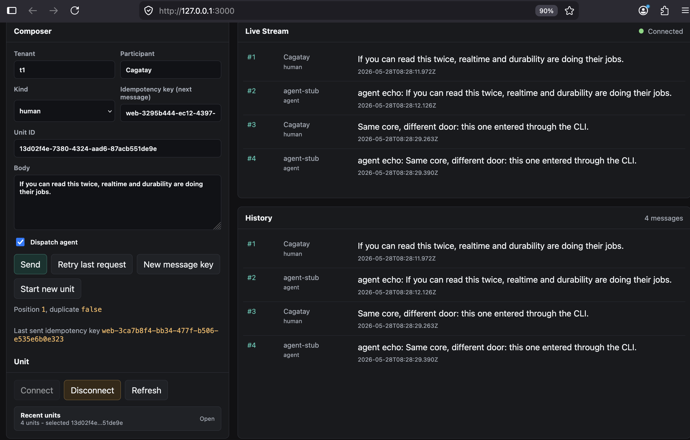

# Iron Bridge Orchestration Layer

This is a modular orchestration substrate for long-running human + agent work.
The agent is intentionally a stub; the important pieces are durable history,
tenant isolation, concurrent ordering, idempotent intake, and realtime observation.

## Console Preview



## Architecture

```text
src/
  domain/                 Pure domain types and errors
  application/            Use-cases and ports, independent of HTTP/Postgres
  storage/postgres/       Durable Postgres implementation with RLS
  realtime/               Realtime publish/subscribe and SSE streaming
  intake/http/            HTTP adapter for the application core
  intake/cli/             CLI adapter using the same core command
  agent/                  100ms stub agent
```

The HTTP layer is only an intake adapter. A CLI, email poller, scheduled trigger, or
new webhook shape can submit work by constructing the same `SubmitMessageCommand`
and calling `Orchestrator.submitMessage()`.

## Technology Stack

| Technology | Role |
| --- | --- |
| TypeScript | Main application language and shared contract definitions |
| Node.js | Runtime for the HTTP server, CLI adapter, agent dispatcher, and tests |
| Fastify | HTTP server framework for `POST /messages`, SSE endpoints, health checks, and the dashboard |
| PostgreSQL | Durable storage for units of work, messages, idempotency records, and agent jobs |
| SQL | Database migrations, tables, constraints, indexes, foreign keys, and RLS policies |
| Postgres Row-Level Security | Structural tenant isolation below the application layer |
| Server-Sent Events | Realtime unit observation without polling |
| HTML/CSS/Vanilla JavaScript | Browser dashboard used as a manual test surface |
| Vitest | Integration test runner for durability, idempotency, ordering, RLS, and realtime behavior |
| Docker Compose | Local PostgreSQL environment |

## Intake Normalization

The core orchestration layer is intentionally independent from any single input
mechanism. Each intake adapter parses its external format, normalizes it into a
`SubmitMessageCommand`, and sends it to the same core entry point:

```text
HTTP POST
CLI command
Email poller
Webhook
Scheduled trigger
        |
        v
SubmitMessageCommand
        |
        v
Orchestrator.submitMessage(command)
        |
        v
Postgres transaction + ordering + idempotency + agent dispatch
```

The currently implemented adapters are HTTP and CLI. Email, webhook, and
scheduled trigger adapters would follow the same boundary without changing the
core orchestration logic.

### HTTP Intake

```http
POST /messages
Idempotency-Key: web-123

{
  "tenant": "t1",
  "participant": "alice",
  "participantKind": "human",
  "body": "ping",
  "unitId": "<optional-unit-id>",
  "dispatchAgent": true
}
```

The HTTP adapter validates the payload, reads the `Idempotency-Key` header or
body field, and calls:

```ts
await orchestrator.submitMessage({
  tenantId: body.tenant,
  participantId: body.participant,
  participantKind: body.participantKind,
  body: body.body,
  unitId: body.unitId,
  idempotencyKey,
  dispatchAgent
});
```

### CLI Intake

```bash
npm run intake:cli -- \
  --tenant t1 \
  --participant alice \
  --body "hello from cli" \
  --unit-id <optional-unit-id>
```

The CLI adapter parses terminal arguments and normalizes them into the same
command. `--kind` defaults to `human`, so the command above is equivalent to
passing `--kind human`.

```ts
await orchestrator.submitMessage({
  tenantId: options.tenant,
  participantId: options.participant,
  participantKind: options.kind,
  body: options.body,
  unitId: options.unitId,
  idempotencyKey: options.idempotencyKey,
  dispatchAgent: options.dispatchAgent
});
```

By default the CLI submits through the running HTTP server, so browser and curl
SSE observers can see the message live. It can also run in direct mode for a
non-HTTP adapter demonstration:

```bash
npm run intake:cli -- \
  --transport direct \
  --tenant t1 \
  --participant alice \
  --body "direct cli message"
```

### Email Poller Shape

An email poller is not required for this exercise, but it would use the same
normalization boundary. For example, an incoming email:

```text
From: alice@example.com
To: support+t1@example.com
Subject: Re: Unit <unit-id>
Message-ID: email-789

Can you check this?
```

could be normalized as:

```ts
await orchestrator.submitMessage({
  tenantId: "t1",
  participantId: "alice@example.com",
  participantKind: "human",
  body: "Can you check this?",
  unitId: "<unit-id>",
  idempotencyKey: "email:email-789",
  dispatchAgent: true
});
```

The `Message-ID` becomes the idempotency key, so reprocessing the same email
does not create duplicate messages.

### Scheduled Trigger Shape

A scheduled job can also be normalized into a message-like command:

```ts
await orchestrator.submitMessage({
  tenantId: "t1",
  participantId: "scheduler",
  participantKind: "system",
  body: "Daily check-in",
  unitId: "<unit-id>",
  idempotencyKey: "daily-checkin:t1:2026-05-28",
  dispatchAgent: true
});
```

This keeps scheduling concerns outside the core while still reusing durable
history, ordering, idempotency, and agent dispatch.

## Key Guarantees

| Requirement | Implementation |
| --- | --- |
| Structural multi-tenancy | Postgres Row-Level Security using session-local `app.tenant_id` |
| Durable history | `units_of_work`, `messages`, `intake_requests`, and `agent_jobs` tables |
| Concurrent ordering | Transactional append with `SELECT ... FOR UPDATE` on the unit row |
| Idempotent intake | `UNIQUE (tenant_id, idempotency_key)` plus `ON CONFLICT` at storage layer |
| Realtime observers | Server-Sent Events, no polling |
| Multi-participant | Messages store `participant_id` and `participant_kind` |
| Restart recovery | Agent jobs are durable and stale running jobs are recovered |

## Run Locally

```bash
npm install
npm run db:up
npm run db:migrate
npm run dev
```

The service listens on `http://localhost:3000` by default.

Open the browser console:

```bash
open http://127.0.0.1:3000/
```

## API

Submit a message:

```bash
curl -s http://localhost:3000/messages \
  -H 'Content-Type: application/json' \
  -H 'Idempotency-Key: demo-1' \
  -d '{
    "tenant": "t1",
    "participant": "alice",
    "body": "ping"
  }'
```

Continue an existing unit:

```bash
curl -s http://localhost:3000/messages \
  -H 'Content-Type: application/json' \
  -H 'Idempotency-Key: demo-2' \
  -d '{
    "tenant": "t1",
    "participant": "alice",
    "unitId": "<unit-id>",
    "body": "again"
  }'
```

Watch a unit with SSE:

```bash
curl -N 'http://localhost:3000/units/<unit-id>/events?tenant=t1'
```

Fetch durable history:

```bash
curl -s 'http://localhost:3000/units/<unit-id>/messages?tenant=t1'
```

## Tests

```bash
npm test
```

The integration tests require Postgres on `localhost:5432`. With Docker Desktop
running, `npm run db:up` starts the expected database.

Test coverage maps directly to the hard requirements:

| Test | Proof |
| --- | --- |
| `rls.test.ts` | Raw `SELECT * FROM units_of_work` only sees the bound tenant |
| `idempotency.test.ts` | 20 concurrent retries with the same key persist one message |
| `ordering.test.ts` | 20 concurrent messages plus agent replies get gap-free positions |
| `durability.test.ts` | History and pending agent work survive service recreation |
| `realtime.test.ts` | Two SSE observers receive the same messages in the same order |
